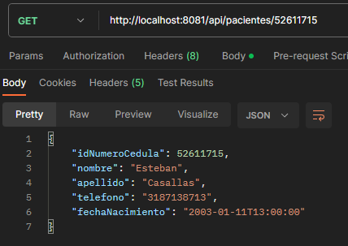

# Hospital - API

Desarrollo de una API-REST, la cual consiste en el manejo y persistencia de las citas que un hospital realiza, y que tiene como base el modelo *cliente-servidor*.
Este es un aplicativo web (REST API) que por medio de formularios reciba la información de pacientes y doctores, los almacenen en una base de datos, en este caso el aplicativo va a permitir realizar las operaciones bases CRUD sobre los datos:

**También se especifica el método de rutas correspondiente**

- *Create = post* 

- *Read = get*

- *Update = put*

- *Delete = delete*


## INSTALACIÓN - CONFIGURACIÓN
Para usar el proyecto en su repositorio local, siga cuidadosamente las indicaciones, teniendo en cuenta que debe clonar el repositorio
inicialmente, luego siga las instrucciones indicadas:

- Instalar las dependencias del proyecto
```code
    mvn clean install
```
- Luego inicializar el proyecto
```code
    mvn spring-boot:run
```

## TECNOLOGÍAS
Las tecnologías que se usaron en el proyecto fueron las siguientes:
-  Java
-  Spring Boot
-  Postman
-  MySQL
-  Git


## API REST- CONSULTORIO
*El modelo de datos se realizó, bajo el modelo entidad relación, el cual constituye un flujo de datos estructurado y basado en la integridad referencial de las entidades.*


#### RUTAS API

Para consumir la API correctamente tener en cuenta las rutas determinadas en la lógica del negocio del hospital..

----

#### *Doctores*
```http
  GET      /api/doctores
  GET      /api/doctores/{id}
  POST     /api/doctores/{body}
  PUT      /api/doctores/{id}
  DELETE   /api/doctores/{id}
```
##### **body**
```json
    {
        "idProfesional": 109882231,
        "nombre": "Juan",
        "apellido": "Pablo",
        "correo": "pablit0@gmail.com",
        "especialidad": "medicina_interna"
    } 

```
-----

#### *Pacientes*
```http
  GET      /api/pacientes
  GET      /api/pacientes/{id}
  POST     /api/pacientes/{body}
  PUT      /api/pacientes/{id}
  DELETE   /api/pacientes/{id}
```
##### **body**
```json
    {
        "idNumeroCedula": 100502873,
        "nombre": "Martin",
        "apellido": "Elias",
        "fechaNacimiento": "2003-12-11T21:00:00",
        "telefono": "318729871"
    }

```
-----
#### *Cita*
```http
  GET      /api/citas   
  GET      /api/citas/{data}
  POST     /api/citas/{id}
  PUT      /api/citas/{id}
  DELETE   /api/citas/{id}
```
##### **body**
```json
    {
        "fechaHora": "2025-11-21T22:00:00",
        "idProfesional": 109012122,
        "idNumeroCedula":  52611715

    }
```


### Ejemplo para el uso de parametros
#### Get item {id} 

```http
  GET /api/consultorio/${id}
```

| Parámetro | Tipo     | Descripción                       |
| :-------- | :------- | :-------------------------------- |
| `id`      | `int` | **Required**. Id del recurso |

-----
### PRUEBAS - API

# Citas
- get cita


- get cita :id


- post cita


- put cita :id


-delete cita


----

# Doctores

- get doctores


- get doctores :id


- post doctores


- put doctores :id


- delete doctores


----
# Pacientes

- get pacientes


- get pacientes :id



- post pacientes


- put pacientes :id


- delete pacientes


